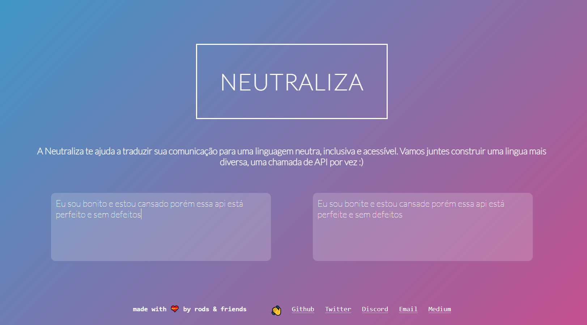

# Neutraliza

A Neutraliza é uma API escrita em C que te ajuda a traduzir sua comunicação para uma linguagem **_neutra_**, **_não sexista_** e **_inclusiva_**.



Palavras importam. E palavras constroem mundo. Se é verdade que a língua é viva e construída por nós a cada momento, então todos os dias temos em mãos a possibilidade de construir uma língua que tem espaço para a existência de todes.

A Neutraliza surge então como um esforço objetivo em direção a construir um mundo novo, mais inclusivo e receptivo da pluralidade de existências. Vamos juntes construir esse mundo, começando pelas palavras :)

## Como rodar localmente
---
A Neutraliza está dando seus primeiros passos, e por isso ainda não é possível acessá-la via web, fazendo-se necessário baixar, compilar e subir o servidor para então poder utilizá-la na porta 4242 da máquina local (`localhost:4242`).

### Passo 1 - baixar este repositório
``` bash
git clone https://github.com/42sp/42labs-selection-process-v2-rodsmade.git Neutraliza
cd Neutraliza
```

### Passo 2 - instalar a biblioteca libcurl
(permite realizar chamadas externas à API de dicionário)
``` bash
apt-get install libcurl4-gnutls-dev
```

### Passo 3 - compilar e subir o servidor
``` bash
cd web-server
make
make run
```
(obs.: para testar se o servidor está de pé, inserir `http://localhost:4242/` na barra de endereços do navegador)

### Passo 4 - abrir a interface gráfica da Neutraliza pelo navegador
``` bash
http://localhost:4242/v1.0/home
```

Pronto! Agora é só enviar seus textos para serem neutralizados! :)

## Endpoints
---
- ` GET /` -  Raiz. Teste para verificar o status do servidor.
- ` GET /v1.0/home` - Landing page. Interface gráfica para utilizar a API pelo navegador.
- ` POST /v1.0/translation + body` - Envie o texto para ser traduzido! O texto deve ser enviado no corpo da requisição.

## Tech Stack
---
### Backend:
- [Mongoose](https://mongoose.ws/) - Embedded Web Server
- [cJSON](https://github.com/DaveGamble/cJSON) - Ultralightweight JSON parser in ANSI C.
- [libcurl](https://curl.se/libcurl/) - the multiprotocol file transfer library

### Front-end:
- HTML
- CSS
- Javascript

### Integração:
- [Dicio-API](https://github.com/ThiagoNelsi/dicio-api/link) por ThiagoNelsi no Github.
- (WIP) Banco de dados local (SQL? SQLite?) para buscar substituições inteiras

## Árvore de diretórios
---
* ```desafio-labs/```
	Arquivos originais do repositório.

* ```logs/```
	Onde ficam guardados os logs da API.

* ```neutre-cli/```
	Interface de linha de comando (Command Line Interface - CLI) auxiliar à API que permite vasculhar os logs para aferir o estado de funcionamento da API e gerar _insights_.

* ```neutre-cli/man_pages```
	Manual de uso da CLI neutre (formato Troff).

* ```web-server/```
	Eis a API Neutraliza!

* ```web-server/resources```
	Front-end para a API Neutraliza.

* ```*/bin/```
	Onde se encontram os binários (arquivos executáveis) do servidor (`neutraliza-web-server`) e da CLI (`neutre-cli`) após a compilação.

* ```*/include/```
	Todos os arquivos de header (.h) necessários para compilar cada programa.

* ```*/obj/```
	Destino dos arquivos de código objeto (.o) da compilação de cada programa.

* ```*/src/```
	Códigos fonte (.c) de cada programa.

* ```*/miscellaneous/```
	Arquivos auxiliares utilizados ao longo do processo de construção dos programas, geralmente mains de testes e mocks.


## Sobre os logs
---
Uma estimativa grosseira do arquivo de logs estima em média 500 bytes de informação por log, ou seja, o equivalente a 2 tweets. Nada mal!

Para navegar pelos logs de maneira mais eficiente, escrevi a CLI neutre. Para utilizá-la, é necessário compilar o programa. A partir da pasta raiz (Neutraliza - Passo 1 acima), rode o seguinte comando:
```
cd neutre-cli
make
```
basta adicionar seu endereço (_path_) à variável de ambiente `PATH`. Para tal, é necessário obter o caminho absoluto do binário gerado em `./bin/neutre`, e rodar o seguinte comando com privilégio de administrador (sem os sinais `<>`):
```
sudo export PATH=$PATH:<path/to/bin/neutre>
```
Assim será possível rodar o comando `neutre` a partir de qualquer diretório!

Caso não tenha privilégio de administrador, ainda é possível utilizar a cli rodando o comando `./bin/neutre` a partir do diretório `/neutre-cli`.


Para conhecer as demais opções de `neutre`, abra sua página do `man` rodando o comando:
```
man neutre
```
ou o seguinte comando a partir do diretório `/neutre-cli`:
```
man man_pages/neutre.1
```

## FAQ
---
### O que é uma linguagem neutra (não-binária)?
- É uma linguagem que reconhece a existência de mais gêneros além do masculino e feminino. O português é uma língua majoritariamente binária pois possui apenas duas desinências de gênero: **-a** (gênero feminino) e **-o** (gênero masculino). Para se tornar uma linguagem não-binária, é necessária a adoção de uma terceira desinência de gênero, aqui proposta como **-e**, a desinência de gênero neutro. É particularmente importante para designar _pessoas_ que não se identificam com o gênero feminino ou masculino.

### O que é uma linguagem não-sexista?
- É uma linguagem que não favorece um gênero ao outro. No português, costuma-se utilizar o gênero masculino como genérico, por exemplo: "A 42 forma desenvolvedores humanos". Certamente a escola não atende somente o público masculino, e no entanto, ao se referir a um grupo composto por pessoas de mais de um gênero, por costume/tradição utiliza-se o masculino.

### O que é uma linguagem inclusiva?
-  .

### Por que usar linguagem gênero-neutra?
A consequência não-intencionada de se utilizar o gênero masculino como genérico é a de apagar a presença e a existência de pessoas de outros gêneros em espaços coletivos. E é para ajudar a resolver este problema que a Neutraliza foi concebida :)
- Pessoas não-binárias e intersexuais existem.
- Exemplo das manchetes sobre as cientistas brasileiras do Covid

### O que é linguagem inclusiva?
- Uma linguagem que é acessível para pessoas com diferentes habilidades de leitura. O uso de desinências como o X ou o @ (como em "amig@s" / "amigxs") prejudica a compreensão de pessoas que utilizam leitores de tela. 

### Por quê precisamos de um tradutor para linguagem gênero-neutra e inclusiva?
- Quebrar a resistência. Ao te entregar um texto traduzido
- Disseminar conhecimento e avançar a pauta
- mais empresas e instituições acolhendo a diversidade
- Palavras constroem mundo! Está no nosso alcance construir o mundo em que queremos viver.


